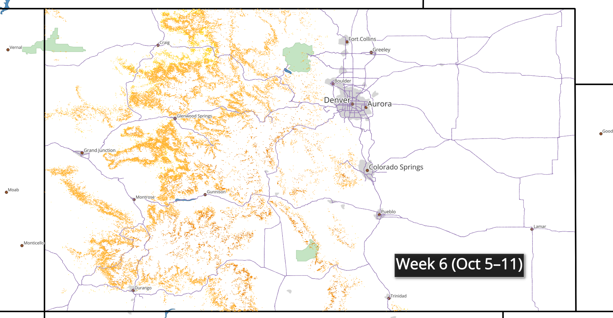

# 📊 Data Analytics Portfolio

Welcome to my portfolio! Here are some of my data analytics projects using SQL, Python, Excel, Tableau, and other tools.

## 🚀 Featured Projects

### 🔹 **ER Visits & Wait Time Dashboard** 
**Tools:** Tableau  
**Summary:** Created an interactive Tableau dashboard visualizing ER usage trends by hour, day, department, and demographic patterns. Includes parameter-based filtering and dynamic charts.  
📊 [View Project](https://public.tableau.com/views/DashboardER/Dashboard?:language=en-US&:sid=&:redirect=auth&:display_count=n&:origin=viz_share_link)

### 🔹 [Joshua Tree Analysis](./project-1_Joshua_Tree/)
**Tools:** Python  
**Summary:** Cleaned difficulty ratings to make them easier to quantify and created tables and graphs to display data.  
📊 [View Project](./project-1_Joshua_Tree/readme.md)  

### 🔹 [Business Analysis](./project-2_midterm/)
**Tools:** Python, Excel, SQL  
**Summary:** Cleaned and explored business data, providing actionable insights for an imaginary company.  
📊 [View Project](./project-2_midterm/readme.md)  

### 🔹 [Social Media Analysis](./project-3_final_project/)
**Tools:** Python, Tableau  
**Summary:** Analyzed social media data for an Asian community organization in Denver to find optimal posting types.  
📊 [View Project](./project-3_final_project/readme.md)  

### 🔹 [AI Crypto Trading Bot Training](./project-4_AI_Crypto_Trading_Bot_Training/)
**Tools:** Python, Birdeye API, ChatGPT  
**Summary:** Training a model for crypto trading (work in progress).  
📊 [View Project](./project-4_AI_Crypto_Trading_Bot_Training/readme.md)  

### 🔹 [Colorado Ozone Mapping](./project-5_colorado_ozone_2024_qgis/)
**Tools:** QGIS, Tableau  
**Summary:** Mapped 2024 ozone levels across Colorado using AQI categories. Produced publication-ready maps, a standalone legend, an animated timelapse GIF, and an interactive Tableau dashboard.  
📊 [View Project](./project-5_colorado_ozone_2024_qgis/README.md) | 🌐 [View Tableau](https://public.tableau.com/app/profile/chris.thai/viz/Colorado2024OzoneLevels/COOzoneAQIValues2024)

### 🍂 [Colorado Leaf Peeping](./Colorado_Leaf_Peeping/)

**Tools:** QGIS, Tableau  
**Summary:** Predicted and visualized Colorado’s fall foliage progression (“leaf peeping”) in 2025 using aspen distribution and elevation data.  
As a first run, it ignores other variables such as latitude or aspect in affecting leaf color. Produced static maps, an animated timelapse GIF, and an interactive Tableau dashboard.

📊 [View Project](./project-6_Leaf_Peeping_2025/readme.md) | 🌐 [View Tableau](https://public.tableau.com/app/profile/chris.thai/viz/shared/3WCD23C5R)

## 📞 Contact
Feel free to connect with me via email at **Christopher.Thai.84@gmail.com**
🔗 [View my Tableau Public profile](https://public.tableau.com/app/profile/chris.thai)
