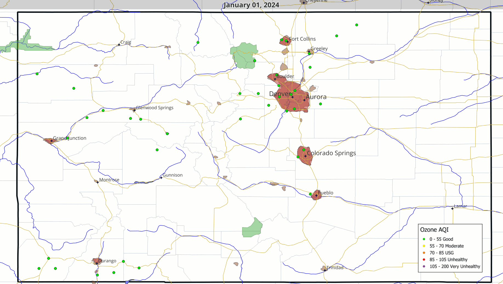

# Colorado Ozone Mapping (QGIS, 2024)

Cartographic analysis of ozone levels across Colorado in 2024 using QGIS.  
Includes publication-ready maps, a custom standalone legend, an animated timelapse GIF, and a Tableau interactive dashboard.

---

## ✨ Highlights
- Clean, exportable maps styled with **EPA AQI categories**
- Custom legend exported separately for flexible use in reports
- Animated timelapse GIF to visualize ozone distribution across regions
- Interactive **Tableau dashboard** version for web-based exploration
- Reproducible QGIS project file (`.qgz`) — not included yet

---

## 📊 Data
- **Source:** Colorado APCD ozone monitoring network, 2024  
  _(raw data accessible via [EPA AQS DataMart](https://www.epa.gov/aqs))_  
- **Processing:** Categorized by AQI thresholds (Good, Moderate, USG, Unhealthy, etc.).

---

## 📦 Outputs

**Statewide Map**  

**Legend**  

**Timelapse GIF**  

---

## 🔁 Reproduce
Open the QGIS project (`.qgz`) and re-point data sources if paths break  
(**Right-click layer → Set Data Source**).

---

## 🌐 Tableau Interactive Version
For an interactive web-based version of this map, view it on Tableau Public:  
📊 [Colorado 2024 Ozone Levels (Tableau)](https://public.tableau.com/app/profile/chris.thai/viz/Colorado2024OzoneLevels/COOzoneAQIValues2024)

---

## 📜 License
- Code & configs: MIT  
- Maps & visuals: CC BY 4.0  

---

## 🙌 Credits
Data courtesy of **Colorado APCD** & **EPA AQS**. Built with **QGIS 3.28** and **Tableau**.
