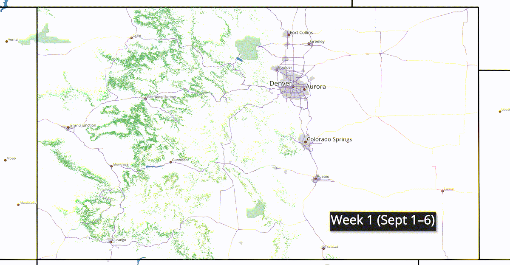

# Colorado Leaf Peeping

This project predicts and visualizes Colorado’s fall foliage progression (“leaf peeping”) in 2025 using aspen distribution and elevation data.  As a first run, it ignores other variables such as latitude or aspect in affecting leaf color 

## Overview
Aspens turn color at different times depending on elevation and location.  
This project explores those patterns with:
- **QGIS maps** – static and animated raster layers by week
- **Tableau dashboard** – interactive version for exploration

---

## QGIS Maps
- **Static Map**:  
  

- **Animated Map** (GIF by week):  
  

**Key Skills:** Raster band classification, cross-join lookup tables, rule-based symbology, QGIS animation.

---

## Tableau Dashboard
Interactive dashboard for exploring week-by-week aspen foliage coverage.  
🔗 [View on Tableau Public]([https://public.tableau.com/app/profile/your_link_here](https://public.tableau.com/shared/BG65R37WJ?:display_count=n&:origin=viz_share_link))

**Key Skills:** Data cleaning, calculated fields, interactive filters, joins, page view, alternate visualization.

---

## Tools Used
- **QGIS**: Spatial joins, raster classification, map design
- **Tableau**: Interactive dashboards, calculated fields, joins, public sharing
